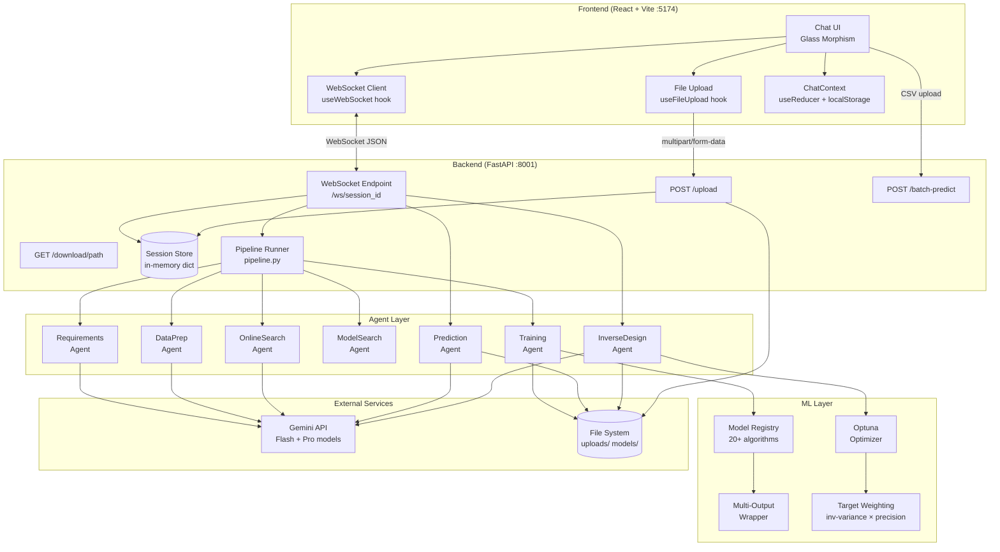
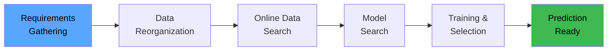
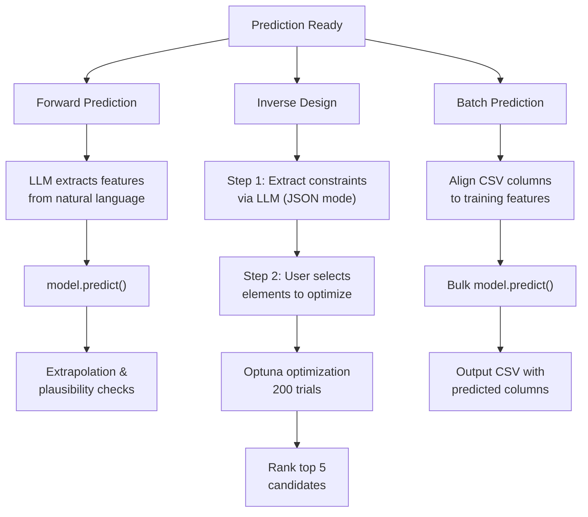
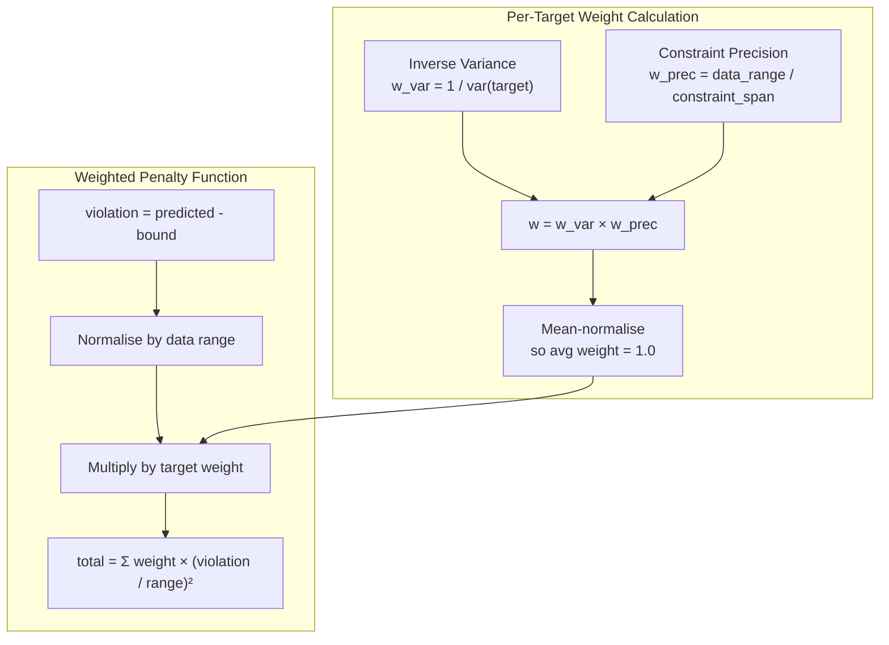
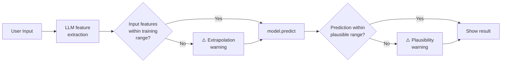

# AlloyGen AI (Gama) — Architecture

## System Overview



## Pipeline Flow



### Post-Pipeline Capabilities



## Inverse Design Weighting (Multi-Output)



**Weight examples:**
- Tight constraint `hardness 49-51` (span=2) over data range 500 → high `w_prec`
- Low-variance target → high `w_var`
- One-sided constraint (only min or max) → neutral `w_prec = 1.0`

## Prediction Safety



## Tech Stack

| Layer | Technology |
|-------|-----------|
| Frontend | React 19, TypeScript, Tailwind CSS 4, Vite 8 |
| Backend | FastAPI, Python 3.9+, WebSocket |
| ML | scikit-learn, XGBoost, LightGBM, CatBoost, Optuna |
| LLM | Gemini API (Flash for extraction, Pro for analysis) |
| State | In-memory sessions (backend), localStorage (frontend) |

## File Structure

```
Alloy Gen Chatbot/
├── backend/
│   ├── main.py              # FastAPI app, WebSocket, endpoints
│   ├── pipeline.py           # Session dataclass, pipeline runner
│   ├── config.py             # Environment config (Gemini keys, limits)
│   ├── errors.py             # Custom exceptions
│   └── agents/
│       ├── base_agent.py     # BaseAgent with LLM chat helper
│       ├── requirements_agent.py
│       ├── data_prep_agent.py
│       ├── online_search_agent.py
│       ├── model_search_agent.py
│       ├── training_agent.py
│       ├── prediction_agent.py    # + extrapolation/plausibility checks
│       └── inverse_design_agent.py # + weighted multi-output optimization
├── frontend/
│   ├── src/
│   │   ├── App.tsx
│   │   ├── index.css         # Glass morphism theme
│   │   ├── types.ts
│   │   ├── constants.ts      # Pipeline step definitions
│   │   ├── context/ChatContext.tsx
│   │   ├── hooks/
│   │   │   ├── useWebSocket.ts
│   │   │   └── useFileUpload.ts
│   │   └── components/
│   │       ├── Header.tsx
│   │       ├── Sidebar.tsx
│   │       ├── ChatPanel.tsx      # + welcome state
│   │       ├── ChatMessage.tsx    # + avatars, timestamps
│   │       ├── PipelineTracker.tsx # + progress line
│   │       ├── FileUpload.tsx
│   │       ├── TypingIndicator.tsx
│   │       ├── ReconnectBanner.tsx
│   │       └── ToastContainer.tsx
│   └── vite.config.ts        # Proxy /ws → :8001
├── models/                    # Saved .joblib models
├── uploads/                   # Temporary uploaded files
├── dev.sh                     # Start both servers
└── requirements.txt
```
